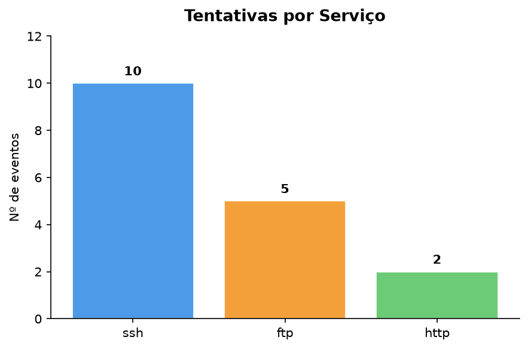
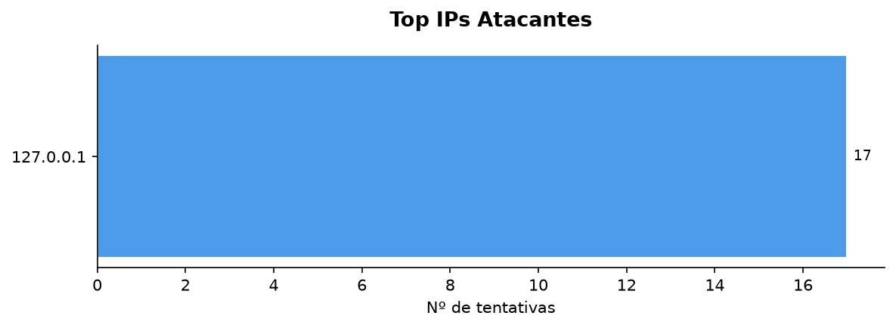
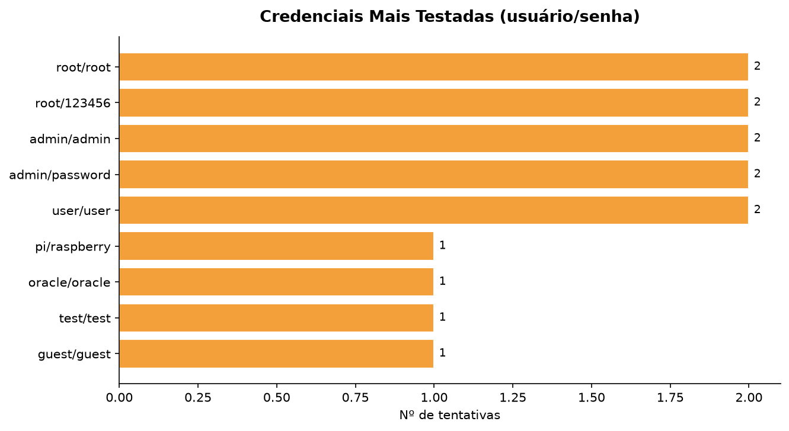
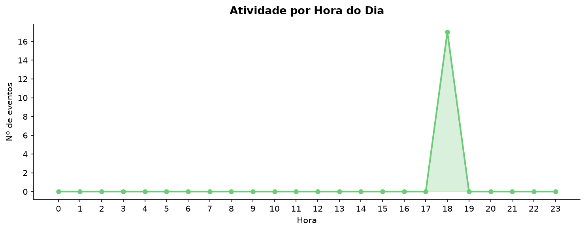
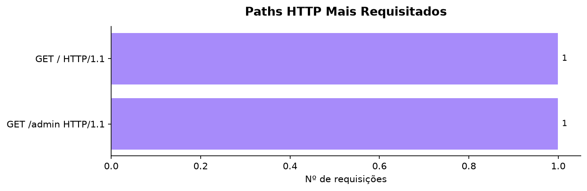
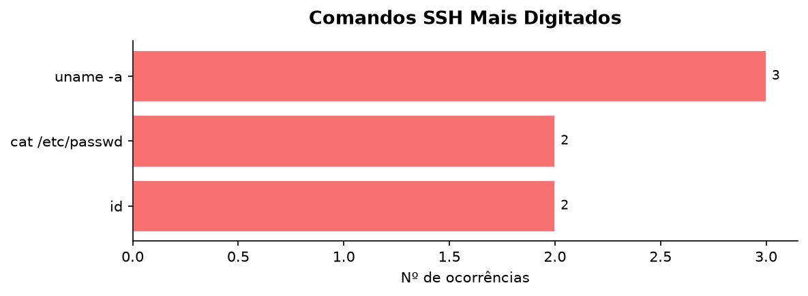

# 🍯 Relatório de Análise — Honeypot

> Gerado em: **19/07/2026 18:24:08**  
> Arquivo de log analisado: `logs/eventos.json`

---

## 1. Sumário Geral

| Métrica | Valor |
|---|---|
| Total de eventos capturados | **17** |
| Eventos — SSH | 10 |
| Eventos — FTP | 5 |
| Eventos — HTTP | 2 |

---

## 2. IPs Mais Ativos

| # | IP de Origem | Tentativas |
|---|---|---|
| 1 | `127.0.0.1` | 17 |

---

## 3. Credenciais Mais Testadas

### 3.1 Top usuários

| # | Usuário | Ocorrências |
|---|---|---|
| 1 | `root` | 4 |
| 2 | `admin` | 4 |
| 3 | `user` | 2 |
| 4 | `pi` | 1 |
| 5 | `oracle` | 1 |
| 6 | `test` | 1 |
| 7 | `guest` | 1 |

### 3.2 Top senhas

| # | Senha | Ocorrências |
|---|---|---|
| 1 | `root` | 2 |
| 2 | `123456` | 2 |
| 3 | `admin` | 2 |
| 4 | `password` | 2 |
| 5 | `user` | 2 |
| 6 | `raspberry` | 1 |
| 7 | `oracle` | 1 |
| 8 | `test` | 1 |
| 9 | `guest` | 1 |

### 3.3 Top pares usuário/senha

| # | Par (usuário/senha) | Tentativas |
|---|---|---|
| 1 | `root` / `root` | 2 |
| 2 | `root` / `123456` | 2 |
| 3 | `admin` / `admin` | 2 |
| 4 | `admin` / `password` | 2 |
| 5 | `user` / `user` | 2 |
| 6 | `pi` / `raspberry` | 1 |
| 7 | `oracle` / `oracle` | 1 |
| 8 | `test` / `test` | 1 |
| 9 | `guest` / `guest` | 1 |

---

## 4. Horários de Pico

> Hora com maior atividade: **18h** (17 eventos)

---

## 5. Paths HTTP Mais Requisitados

| # | Requisição | Contagem |
|---|---|---|
| 1 | `GET / HTTP/1.1` | 1 |
| 2 | `GET /admin HTTP/1.1` | 1 |

---

## 6. Comandos SSH Digitados

| # | Comando | Ocorrências |
|---|---|---|
| 1 | `uname -a` | 3 |
| 2 | `cat /etc/passwd` | 2 |
| 3 | `id` | 2 |

---

## 7. Interpretação dos Resultados

Os dados capturados pelo honeypot revelam padrões típicos de ataques automatizados observados em ambientes reais:

- **Credential stuffing / brute-force**: a maioria das tentativas usa credenciais padrão de fábrica (`root/root`, `admin/admin`) e senhas triviais (`123456`, `password`). Ferramentas como *Hydra* e *Medusa* são frequentemente usadas para automatizar esse processo.

- **Reconhecimento pós-acesso**: os comandos mais digitados no shell falso (`whoami`, `id`, `uname -a`, `cat /etc/passwd`) são tipicamente os primeiros passos de um atacante que obtém acesso inicial — busca de informações sobre o sistema e nível de privilégio.

- **Varredura de aplicações web**: os paths HTTP mais acessados (`/wp-login.php`, `/.env`, `/phpmyadmin`, `/admin`) indicam scanners automatizados procurando vulnerabilidades conhecidas em WordPress, painéis de administração e arquivos de configuração expostos.

- **Concentração horária**: a distribuição por hora revela que ataques automatizados ocorrem de forma contínua, independentemente do horário, evidenciando o uso de bots e scripts.

---

## 8. Considerações Éticas e Legais

O uso de honeypots levanta questões importantes que devem ser observadas em qualquer implantação real:

| Aspecto | Orientação |
|---|---|
| **Isolamento** | O honeypot nunca deve ter acesso a sistemas de produção ou dados reais. |
| **Responsabilidade legal** | Capturar tráfego de terceiros pode ser regulado por legislação local (ex.: LGPD no Brasil, GDPR na Europa). |
| **Divulgação** | Dados coletados devem ser usados apenas para fins defensivos/acadêmicos, nunca publicados com IPs reais sem anonimização. |
| **Transparência** | Documentar e comunicar ao gestor de TI/segurança qualquer implantação de honeypot em redes corporativas. |
| **Não retaliar** | O objetivo é observar, nunca contra-atacar IPs identificados. |

---

*Relatório gerado automaticamente por `analisar_logs.py` — Projeto Final de Segurança Computacional.*